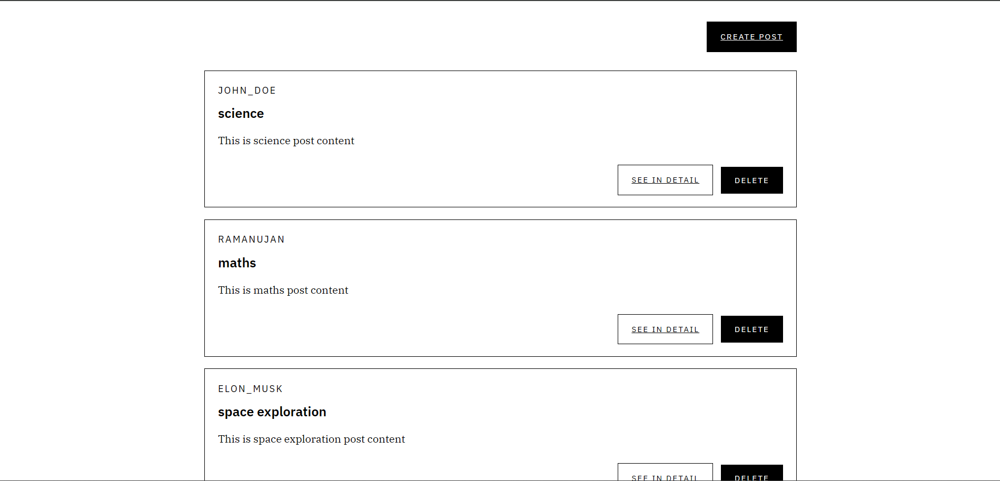
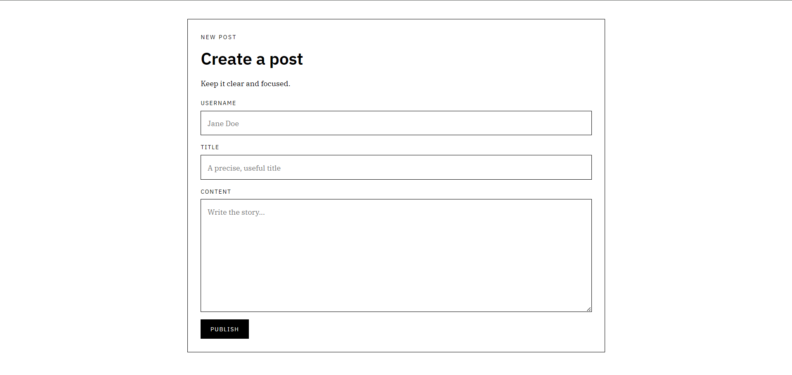
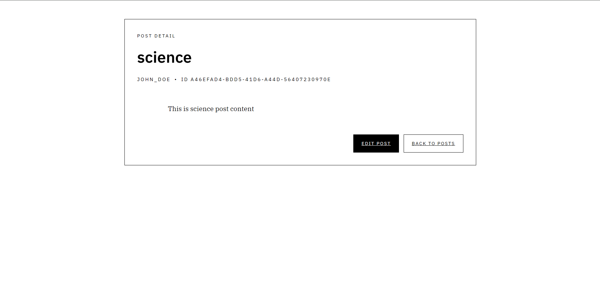
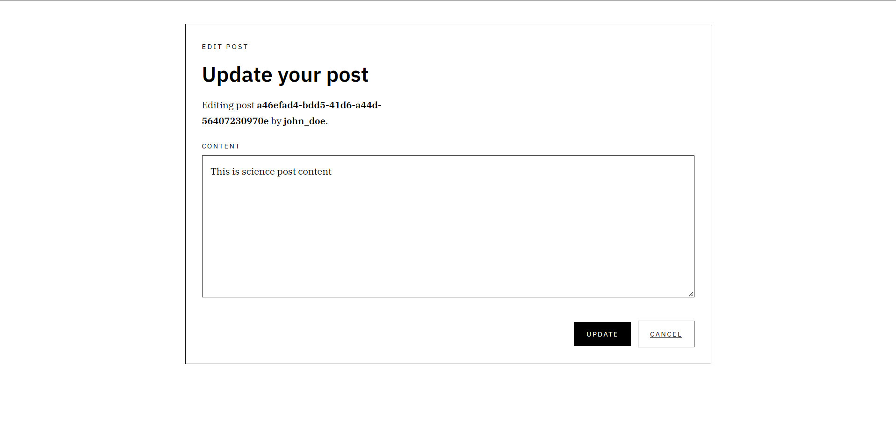
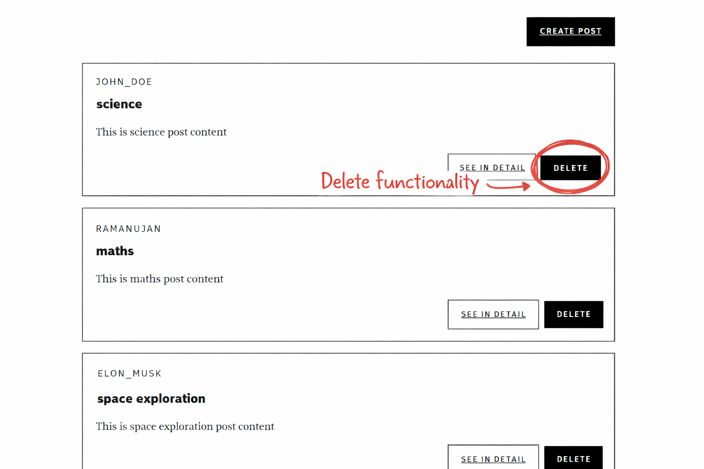

# Blog App

A simple and professional blog application built with Express and EJS.
It lets users create, view, update, and delete blog posts through a clean UI.

## Features
- View all blog posts on the home page.
- Create a new blog post.
- Open a single post detail page.
- Edit existing post content.
- Delete a post.
- Server-side rendered pages using EJS templates.

## Tech Stack
- Node.js
- Express.js
- EJS
- Method Override
- UUID

## Project Structure
```text
Blog_App/
|-- index.js
|-- package.json
|-- public/
|   |-- CSS/
|   `-- static/
`-- views/
    |-- index.ejs
    |-- new.ejs
    |-- show.ejs
    `-- edit.ejs
```

## Getting Started
1. Install dependencies:
   ```bash
   npm install
   ```
2. Start the app:
   ```bash
   node index.js
   ```
3. Open in browser:
   ```text
   http://localhost:3000/posts
   ```

## Main Routes
- `GET /posts` - Show all posts
- `GET /posts/new` - Show form to create a post
- `POST /posts` - Create a post
- `GET /posts/:id` - Show a single post
- `GET /posts/:id/edit` - Show edit form
- `PATCH /posts/:id` - Update post content
- `DELETE /posts/:id` - Delete a post

## Screenshots
### Home Page


### Create Post


### Post Detail


### Update Post


### Delete Post


## Notes
- Data is currently stored in memory, so posts reset when the server restarts.
- Default server port is `3000`.
